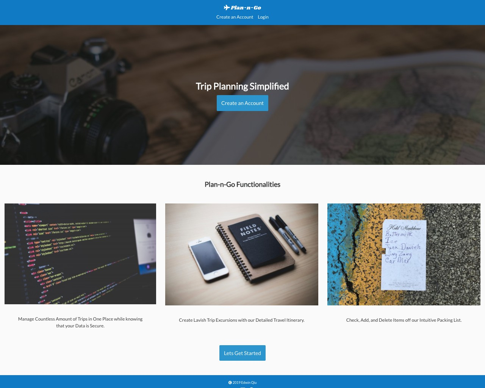
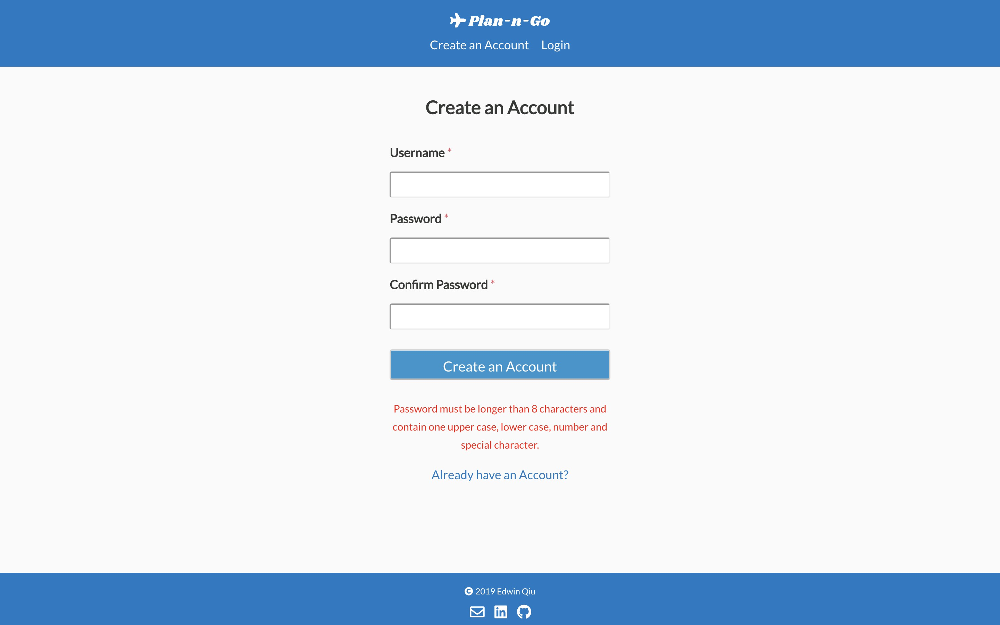
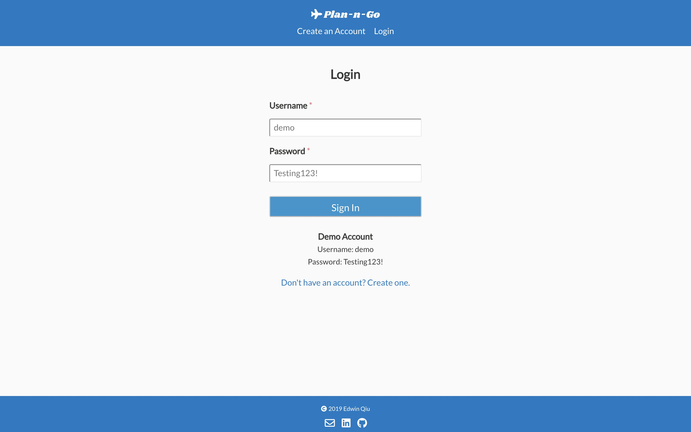
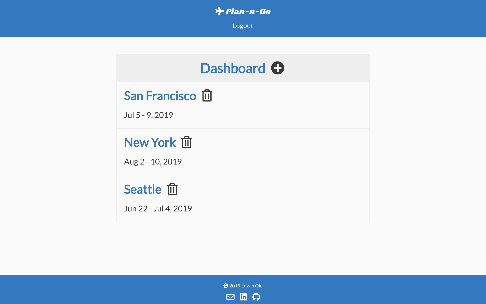
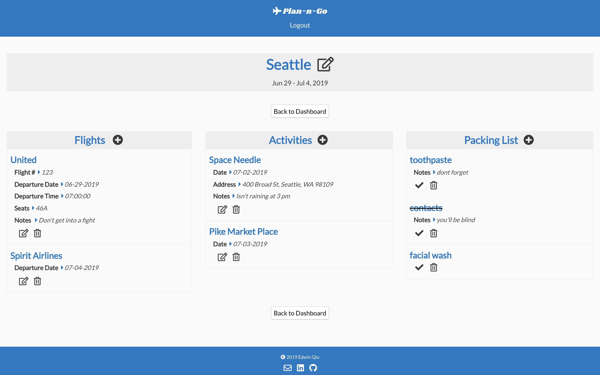
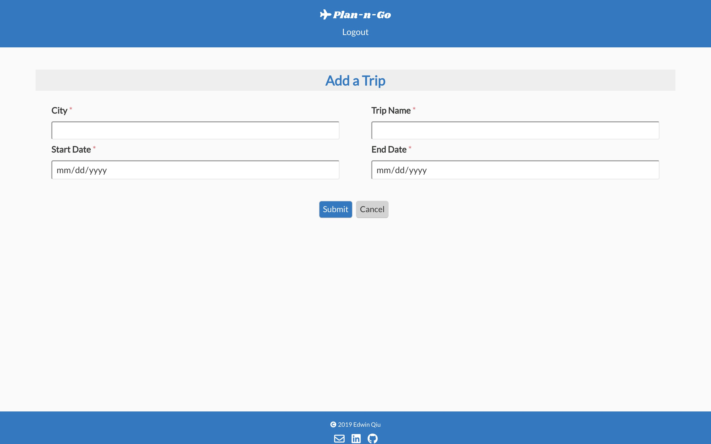

# Plan-n-Go

Often times, getting started and planning a trip is the most stressful part of the process. Plan-n-Go helps simplify the experience by keeping all trip details in one spot. Users can create detailed travel itineraries and manage their packing list with ease. 

## Demo

- Live Preview can be found at : https://plan-n-go-app.now.sh/

## Server Side Github Repo

- https://github.com/Edweezu/plan-n-go-api

## Screenshots

|  Landing Page  | Create Account |  Login |  
| -- | -- | -- |
|  |  |  

|  Trips Dashboard  |  Trips Detail  |  Add Trip  |
| -- | -- | -- |
|  |  | 

## Technologies Used
  - Javascript
  - CSS3
  - React
  - Node
  - Express
  - PostgreSQL
  - Mocha
  - Chai
  

## Development RoadMap (v2)
 - Having helpful menu popups for Account Creation and POST routes in order to better guide the user
 - Nav links when logged in that scroll to each specific section
 - Trip Notes Component at the bottom so user can jot down anything
 - Search Bar for Packing List
 - Packing List Overflow Management 
